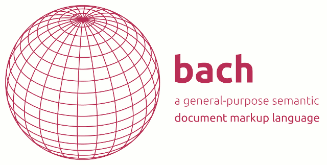

# Bach

**A general-purpose semantic document markup language**

*This repository contains the reference implementation for Python >= 3.4*

Bach is for anyone writing structured semantic text that is parsed into a
data structure to be transformed programmatically.

Our key use cases for Bach are multilingual documents, technical
documentation, and static website generators. Bach is also suitable
as a succinct generator for HTML, as a command language (similar to
[McCarthy 1982](http://www-formal.stanford.edu/jmc/cbcl2/cbcl2.html)), or as a text-based
data interchange format.

Bach is (by design) less powerful than most other data-interchange formats,
such as JSON. Bach is exactly as powerful as it needs to be, and no more. This
makes it easy to work with.

## At A Glance

A Bach document is a tuple:

    document = (label, shorthand-attributes, attributes, contents)

**label:** a string with domain-specific semantics. You might like to think of
it as a function name.

**shorthand-attributes:** a mapping of special shorthand symbol characters to
an array of attribute value strings.

**attributes:** a mapping of attribute name strings to attribute value strings.

**contents:** an ordered collection of zero or more string literals and/or
(sub)documents recursively.

Once parsed into this structure, Bach documents can be easily manipulated using
code.

Bach documents are parseable in linear time to the length of the input and one
byte of lookahead i.e. with an LL(1) parser.

## Example

How best to structure a document depends on your application domain.

Here is one example in HTML-style.

    document
    
    (metadata
        (copyright
            author="Wikipedia Contributors"
            source="https://en.wikipedia.org/wiki/Aardvark"
            license="https://creativecommons.org/licenses/by-sa/3.0/"
        )
        (tags
            "animal"
            "nocturnal"
            "Africa"
        )
    )
    
    (h1 "Aardvark")
    
    (p
        "The aardvark is a medium-sized, burrowing, nocturnal"
        (a "mammal" href="https://en.wikipedia.org/wiki/Mammal")
        "native to Africa."
        (cite #NEB10 location="pp. 3-4")
    )
    
    
    (citations
        (book #NEB10
            chapter     = "Aadvark"
            author      = "Hoiberg, Dale H., ed."
            title       = "The New Encyclopædia Britannica: Macropaedia, Knowledge in depth"
            edition     = "15"
            publisher   = "Encyclopædia Britannica"
            pubdate     = "2010"
        )
    )

Here is another example, in a more hierarchical structure:

    book

    title="The Big Book of Aardvarks"
    
    (chapter
        title="What is an Aardvark?"
        (p "The aardvark is a medium-sized, burrowing, nocturnal mammal native to Africa")
        (figure
            caption="Basic Aadvark facts"
            (table
                (row
                    (cell.title "Scientific name")  (cell "Orycteropus afer")
                    (cell.title "Mass (adult")      (cell "40 to 65 kg")
                    (cell.title "Gestation period") (cell "213 days")
                )
            )
        )
        (figure
            caption="Aardvark Taxonomy"
            src="https://www.itis.gov/servlet/SingleRpt/SingleRpt?search_topic=TSN&search_value=584927#null"
            (taxinomy
                (kingdom "Animalia"
 	                (subkingdom "Bilateria"
                 	      (infrakingdom "Deuterostomia"
 	                        (phylum "Chordata"
                                (subphylum "Vertebrata"
                                    (infraphylum "Gnathostomata"
 	                                    (superclass "Tetrapoda "
                                            (class "Mammalia" by="Linnaeus, 1758"
 	                                            (subclass "Theria" by="Parker and Haswell, 1897"
 	                                                (infraclass "Eutheria" by="Gill, 1872"
                                                        (order "Tubulidentata" by="Huxley, 1872"
                                                            (family "Orycteropodidae" by="Gray, 1821"
                                                                (genus "Orycteropus G." by="Cuvier, 1798"
                                                                    (species "Orycteropus afer" by="Pallas, 1766"))))))))))))))
            )
        )
    )
    

# Syntax and Semantics

A Bach document is a non-empty string that may start with #-style comments,
followed by a label, then optionally attributes, string literals, and
subdocuments in any order. Subdocuments may not contain #-style comments.

Special characters are

    #.*^?!@|~$=:\t\r\n ()[]{}<>"'\\/

A label is any string of non-special characters.

A string literal is quoted by single, double, or bracket quotes. Closing quotes
may be escaped with backslash. A literal backlash must also be escaped.

    'a string'
    "a string"
    [a string]
    'a \' \\ string'
    "a \" \\ string"
    [a \] \\ string]

A shorthand attribute starts with a special shorthand seperator:

    #.*^?!@|~$

A shorthand attribute then is followed by any string of non-special characters.

    #anAttribute
    .anAttribute
    !anAttribute

This is quite similar to the syntax of CSS selectors. For example:

    (anElement#someId.classOne.classTwo enabled title="An Example Element")

Full attributes are any string of non-special characters followed by an equals
or colon followed by a string literal. Whitespace is optional.

    anAttribute="a value"
    anAttribute: "a value"
    anAttribute = "a value"

The assignment may be ommitted, in which case the attribute is present but with
a value such as `Null` or `None` (as distrinct from the empty string).

    (item anAttributeWithNoValue)

Subdocuments start and end with brackets. They are always non-empty.

    (document "a literal" (subdocument) "another literal")

No duplicate full attributes are permitted in any (sub)document.

No duplicate shorthand attributes with the same symbol are permitted in any (sub)document.

## Open Standard

This is the Python reference implementation of Bach. While efficient by the
standards of a pure-Python parser, it is hoped that faster implementations
suitable for real-time, probably written at least partly in C, will shortly
become available.

A full formal grammar is given at [parse.py](python/bach/parse.py) as an array
of tuples. The rules given in Greibach Normal Form with additional lookahead
and semantic notation.

Tawesoft Ltd is committed to supporting Bach as an Open Standard. At this early
stage we invite feedback and comments but, if and as soon as the need arises,
we are keen to see democratic and inclusive stewardship of the language.

## Name

Bach is named for the Welsh term of endearment (literally "small") and as
tribute to the work of computer scientist
[Sheila Greibach](https://en.wikipedia.org/wiki/Sheila_Greibach).

## License

This license applies to the Bach Python 3.4 Reference Implementation, and
associated documentation. We do not claim to copyright Bach *as a language*.

    Bach - a general-purpose semantic document markup language

    Copyright © 2017 Ben Golightly <ben@tawesoft.co.uk>
    Copyright © 2017 Tawesoft Ltd <opensource@tawesoft.co.uk>

    Permission is hereby granted, free of charge, to any person obtaining a copy
    of this software and associated documentation files (the "Software"), to deal
    in the Software without restriction,  including without limitation the rights
    to use,  copy, modify,  merge,  publish, distribute, sublicense,  and/or sell
    copies  of  the  Software,  and  to  permit persons  to whom  the Software is
    furnished to do so, subject to the following conditions:

    The above copyright notice  and this permission notice  shall be  included in
    all copies or substantial portions of the Software.

    THE SOFTWARE IS PROVIDED  "AS IS",  WITHOUT WARRANTY OF ANY KIND,  EXPRESS OR
    IMPLIED,  INCLUDING  BUT  NOT LIMITED TO THE WARRANTIES  OF  MERCHANTABILITY,
    FITNESS FOR A PARTICULAR PURPOSE  AND NONINFRINGEMENT.  IN NO EVENT SHALL THE
    AUTHORS  OR COPYRIGHT HOLDERS  BE LIABLE  FOR ANY  CLAIM,  DAMAGES  OR  OTHER
    LIABILITY, WHETHER IN AN ACTION OF CONTRACT, TORT OR OTHERWISE, ARISING FROM,
    OUT OF OR IN CONNECTION WITH THE SOFTWARE OR THE USE OR OTHER DEALINGS IN THE
    SOFTWARE.
